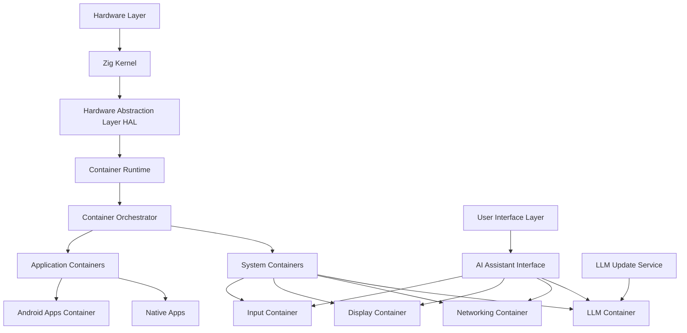
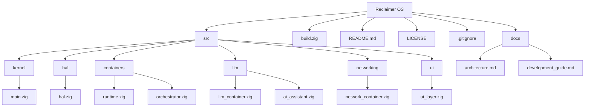

# Reclaimer OS

Reclaimer OS is an innovative, containerized operating system designed for mobile platforms, with a focus on AI integration and modularity. Built primarily in Zig, this project aims to create a next-generation OS that leverages containerization for enhanced security, flexibility, and performance.

## Project Overview

Reclaimer OS combines cutting-edge technologies and concepts:

- **Zig Programming Language**: Primary development language, offering performance and safety.
- **Containerization**: Core architecture for modularity and security.
- **AI Integration**: Built-in Large Language Model (LLM) for advanced OS capabilities.
- **Hardware AI Acceleration**: Designed to leverage AI accelerators in modern mobile chipsets.
- **Android Compatibility**: Initial support for running Android apps in containers.

## Key Features

1. **Containerized Architecture**: Every major OS function runs in its own container.
2. **Integrated AI Assistant**: LLM-powered assistant for enhanced user interaction and system management.
3. **Hardware Abstraction Layer (HAL)**: Efficient hardware management, including AI accelerators.
4. **Networking Stack**: Modular networking with support for cellular, Wi-Fi, and Bluetooth.
5. **Android Compatibility Layer**: Run Android apps within the OS (planned feature).
6. **Security-Focused Design**: Leveraging containerization for enhanced system security.

## Architecture

Reclaimer OS is built on a layered, containerized architecture:

1. **Zig Kernel**: Core OS functionality.
2. **Hardware Abstraction Layer (HAL)**: Manages hardware-specific interactions.
3. **Container Runtime**: Manages and runs containerized components.
4. **Container Orchestrator**: Coordinates different containers.
5. **System Containers**:
   - LLM Container: Integrates AI capabilities.
   - Networking Container: Manages all networking functions.
   - Display Container: Handles graphics and UI.
   - Input Container: Manages user input devices.
   - Application Containers: Run user applications, including potential Android apps.

### Prerequisites

- Zig (latest version)
- QEMU

### Building the Kernel

1. Clone the repository:
   ```
   git clone https://github.com/hotschmoe/reclaimer-os.git
   cd reclaimer-os
   ```

2. Build the kernel:
   ```
   zig build
   ```

3. Run the kernel in QEMU:
   ```
   zig build run
   ```

## Development Status

We are currently in the very early stages of development, focusing on:

1. Setting up a basic kernel that can boot and print a message.
2. Establishing the build system and development workflow.

### Development Checklist

To track our progress and guide our development efforts, we've created a comprehensive checklist:

<details>
<summary>Click to expand Development Checklist</summary>

## Reclaimer OS Development Checklist

### 1. Memory Management
- [ ] Implement basic physical memory allocator
  - Create a bitmap-based page allocator
  - Develop functions for page allocation and deallocation
- [ ] Set up paging and virtual memory
  - Initialize page tables
  - Implement virtual-to-physical address mapping functions
- [ ] Develop a basic heap allocator for kernel use
  - Create simple `kmalloc()` and `kfree()` functions

### 2. Process Management
- [ ] Implement basic process structures
  - Define process control block (PCB) structure
  - Create functions for process creation and termination
- [ ] Develop a simple scheduler
  - Implement a basic round-robin scheduling algorithm
  - Set up timer interrupts for preemptive multitasking

### 3. Interrupt Handling
- [ ] Set up Interrupt Descriptor Table (IDT)
- [ ] Implement basic interrupt handlers
  - Keyboard interrupts
  - Timer interrupts
  - System call interrupts

### 4. Device Drivers
- [ ] Develop a simple keyboard driver
  - Implement keyboard input buffering
  - Set up keyboard interrupt handler
- [ ] Create a basic display driver
  - Implement text mode display functions
  - Develop simple graphics mode if desired

### 5. File System
- [ ] Design and implement a simple in-memory file system
  - Create basic file and directory structures
  - Implement functions for file creation, deletion, reading, and writing

### 6. System Calls
- [ ] Define and implement basic system calls
  - Process control (e.g., fork, exec, exit)
  - File operations (e.g., open, close, read, write)
  - Memory management (e.g., brk, sbrk)

### 7. User Space
- [ ] Set up user space and kernel space separation
  - Implement memory protection mechanisms
- [ ] Develop context switching between kernel and user mode
  - Save and restore process state during switches

### 8. Shell
- [ ] Create a basic command-line interface
  - Implement command parsing and execution
  - Develop built-in shell commands

### 9. Networking
- [ ] Implement a simple networking stack
  - Start with loopback interface support
  - Develop basic TCP/IP stack if desired

### 10. Container Runtime
- [ ] Design the container architecture
  - Define container structure and lifecycle
- [ ] Implement basic containerization features
  - Process isolation
  - File system isolation
  - Resource limiting

### 11. Testing and Documentation
- [ ] Develop a test suite for kernel functions
- [ ] Write detailed documentation for all implemented features
- [ ] Create user and developer guides

### 12. Performance Optimization
- [ ] Profile and optimize critical paths in the kernel
- [ ] Implement more advanced memory management techniques
- [ ] Optimize process scheduling algorithm

### 13. Security Features
- [ ] Implement basic security measures
  - Memory protection between processes
  - Access control for system resources
- [ ] Develop a simple capability-based security model if desired

### 14. AI Integration (Long-term goal)
- [ ] Design AI integration architecture
- [ ] Implement basic AI assistant functionality
- [ ] Develop AI-enhanced system management features

</details>

This checklist represents a high-level overview of the development process. Each item may involve multiple sub-tasks and could be expanded into its own detailed checklist as development progresses. We'll update this checklist as we make progress and refine our goals.

## Contributing

We welcome contributions to Reclaimer OS! Please read our [Contributing Guidelines](CONTRIBUTING.md) for details on our code of conduct and the process for submitting pull requests.

## License

This project is licensed under the Apache License 2.0 - see the [LICENSE](LICENSE) file for details.

## Contact

[Your contact information or project communication channels]

---

## LLM Context Prompt

For developers using LLMs to assist with this project, use the following prompt to provide context:

```
I am developing Reclaimer OS, a containerized operating system for mobile platforms. Here's a summary of the project:

- Primary language: Zig
- Target architecture: AArch64 (ARM64)
- Development environment: Uses QEMU for emulation
- Architecture: Containerized, with each major OS function in its own container
- Current development stage: Early kernel development
- Build system: Custom Zig build script (build.zig)

Key components (planned or in early development):
1. Zig Kernel: Core OS functionality
2. Hardware Abstraction Layer (HAL)
3. Container Runtime and Orchestrator
4. LLM-based AI Assistant integrated into the OS (powerful online API based, with small local model for fallback)
5. Networking stack in a privileged container
6. Planned Android app compatibility container

Project structure:
- src/: Contains all source code
  - kernel/: Core OS functionality
  - hal/: Hardware Abstraction Layer
  - containers/: Container runtime and orchestration
  - llm/: LLM integration and AI assistant
  - networking/: Networking stack
  - ui/: User interface
- docs/: Project documentation
- build.zig: Zig build script

Current focus:
1. Setting up a basic kernel that can boot and print a message
2. Establishing the build system and development workflow

When providing advice or code suggestions, please consider:
- The use of Zig (0.13.0) as the primary language
- The project's containerized architecture
- The target AArch64 architecture
- The early stage of development, focusing on basic kernel functionality
- The use of QEMU for testing and development

Refer to the Development Checklist in the README for upcoming tasks and features to be implemented.
```

This prompt can be used when seeking assistance from AI language models during the development process.

## Architecture

Reclaimer OS is built on a layered, containerized architecture. Here's a high-level view of the system structure:



Key components of the architecture:

[... explanation of components here ...]

## File Structure

Current File Structure, will change as needed:



This file structure is subject to change as the project evolves. Here's a brief explanation of each main component:

- `src/`: Contains all the source code for the OS.
  - `kernel/`: Core OS functionality.
  - `hal/`: Hardware Abstraction Layer code.
  - `containers/`: Container runtime and orchestration logic.
  - `llm/`: LLM integration and AI assistant functionality.
  - `networking/`: Networking stack implementation.
  - `ui/`: User interface code.
- `docs/`: Project documentation.
- `build.zig`: Zig build script.
- `README.md`: Project overview and documentation.
- `LICENSE`: License file.
- `.gitignore`: Specifies intentionally untracked files to ignore.

As development progresses, this structure may be refined to better suit the project's needs.